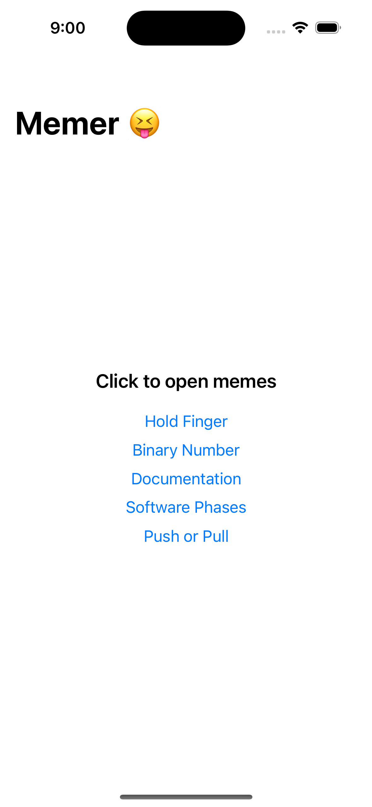
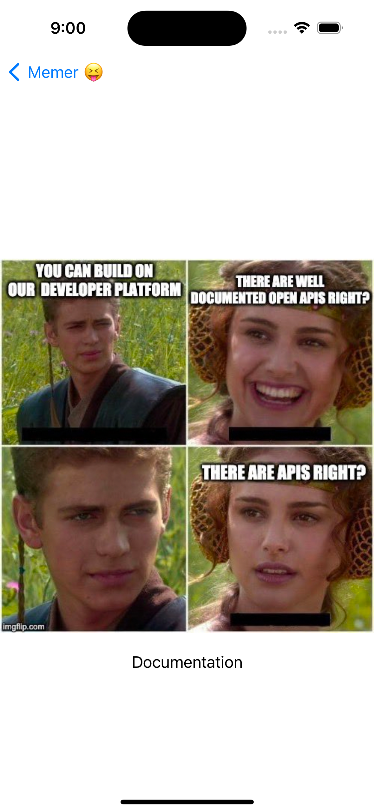

# SwiftUI Memer App

This is a simple SwiftUI app that allows users to view a list of memes and open them in a new page when clicked.

## Features

- Display a list of memes.
- View each meme in detail on a new page.
- Basic navigation between meme list and meme detail pages.
- Navigate back to return to the meme list.
- Data modelling using SwiftUI's `@State` property wrapper.

## Screenshots

## Requirements

- Xcode 13+
- iOS 14.0+

## Installation

1. Clone or download this repository.
2. Open the project in Xcode.
3. Build and run the project on a simulator or device.

## Usage

- Launch the app to see a list of memes.
- Tap on a meme to view it in detail on a new page.
- Swipe back or use the navigation bar to return to the meme list.

## Contributing

Contributions are welcome! If you have suggestions, feature requests, or find any issues, please open an issue or create a pull request.

## License

Open Source License
